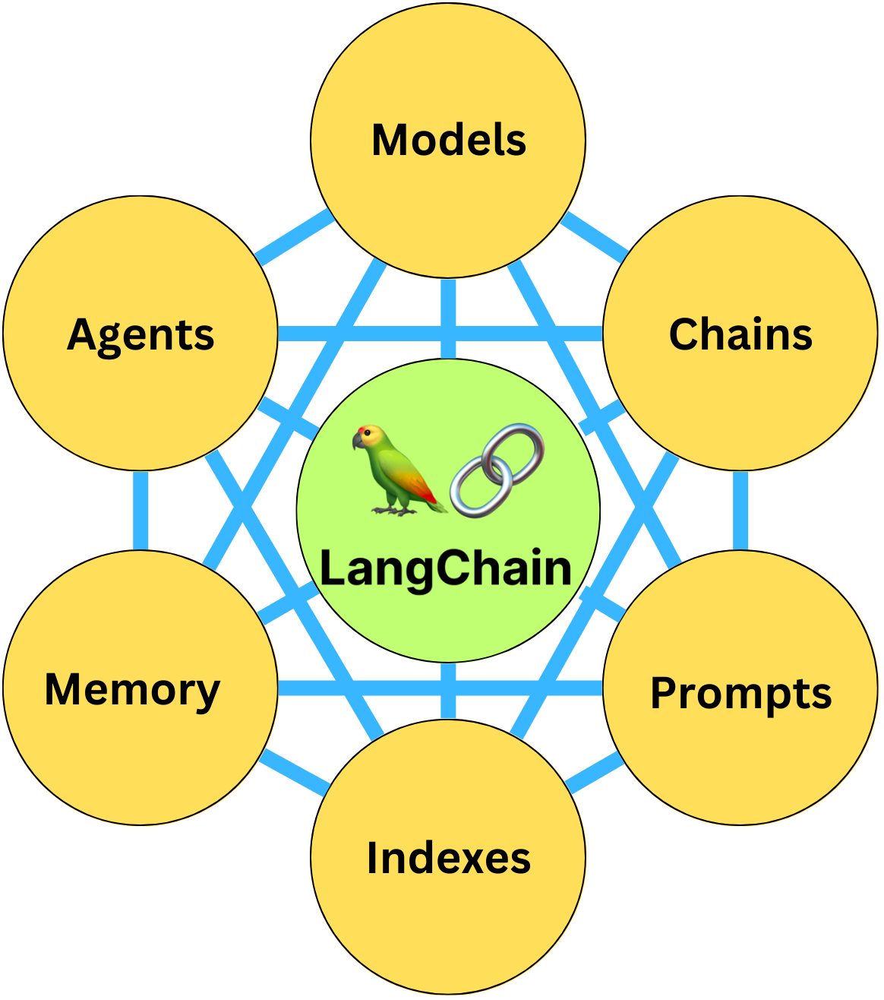
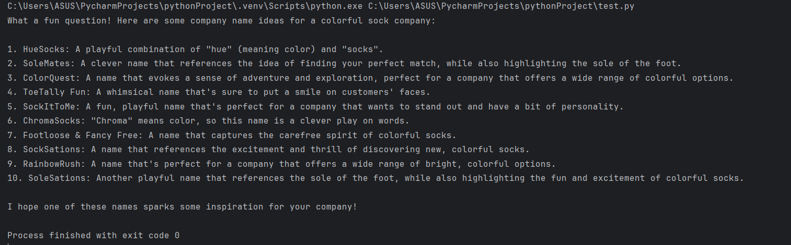

# 1. LangChain

-	LangChain is a framework designed to facilitate the development of applications powered by language models (LLMs) like OpenAI's GPT. It enables developers to integrate LLMs into their applications. 


  


### Chains: 
-  Combining LLMs with different components in a sequence. For instance, you might chain together an LLM to generate text, then send that text to an API, process the result, and send it back to the user.
-  Example code using Groq (Meta) (instead of using OpenAI, because their API key doesn't have a free version for development):
---
```py
from langchain_groq import ChatGroq
from langchain_core.prompts import  ChatPromptTemplate
from langchain_core.output_parsers import StrOutputParser
groq_api_key ='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'
chat = ChatGroq(
    api_key=groq_api_key,
    model_name = "llama3-8b-8192",
    temperature = 0
)
system = "You are a helpful assistant."
human = "{text}"
prompt = ChatPromptTemplate.from_messages(
    [
        ("system", system), ("human", human)
    ]
)
chain = prompt | chat | StrOutputParser()
r=  chain.invoke(
    {"text" : "What would a  good company name be for a company that makes colorful socks?"}
)
print(r)

```

- Analysis:
  - `from langchain_groq import ChatGroq` : This is the client for interacting with Groq's language model.    
  -  `from langchain_core.prompts import ChatPromptTemplate`: This is a component from LangChain that allows you to structure the input prompt.
  -  `from langchain_core.output_parsers import StrOutputParser`: This is used to parse the output into a string format.
  -  **API Key and Model Initialization**: 
     - `groq_api_key ='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'`: API key of Groq ( get from [Groq Key](https://console.groq.com/keys) ) 
     - `model_name = "llama3-8b-8192"`: specifies the language model.
     - `temperature = 0`: This parameter controls the randomness in the response (0 means the responses are more deterministic)
  - System and Human Prompts:
    - `system = "You are a helpful assistant."`: Defines the role of the system (the model will act as a helpful assistant).
    - `human = "{text}"`: This is a dynamic template, where {text} will be replaced by the user’s input.
  - Prompt Creation:
    ```python
    prompt = ChatPromptTemplate.from_messages(
    [
        ("system", system), ("human", human)
    ]
    )
    ```
     This creates a prompt template using both system and human inputs

  - Chain Construction:
    - `prompt`: The structured prompt that includes both system and human inputs.
    - `chat`: The Groq LLM client (equivalent to the LLM model).
    - `StrOutputParser()`: Parses the output into a simple string.
  - Invocation and Output: The invoke method takes an input dictionary with text being the human query and processes it through the chain and after that print the answer to the screen
- After run this code: 
  
